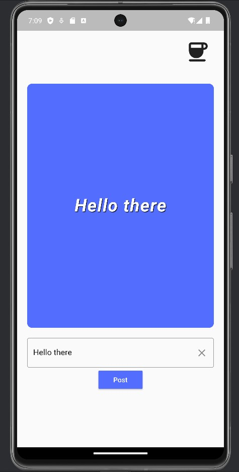

# WidgetsPractice

Welcome to WidgetsPractice, a Flutter project that explores Stateless and Stateful Widgets, widget tree creation, styling, and testing.

## Project Structure

- **lib/main.dart:**
  - Contains the `HomePage` widget where both Stateless and Stateful Widgets are used.
  - Implements a simple app layout with a greeting icon, a text display area, a text input field, and a "Post" button.
  

## Features Implemented

1. **Greeting Icon:**
   - An icon in the top-right corner, representing a coffee cup.

2. **Text Display Area:**
   - A styled text display area that shows the entered text.

3. **Text Input Field:**
   - A text input field with a clear button.

4. **"Post" Button:**
   - A button that posts the entered text to the display area.

## Running the Project

To run the project, follow these steps:

1. Clone the repository:
   ```bash
   git clone https://github.com/your-username/WidgetsPractice.git
